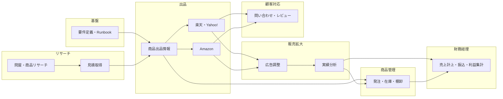

# EC業務 ロードマップ

優先度・依存関係に基づくフェーズ案。期限は設けず、「いつから何に手を付けるか」の目安として整理する。期日は運用に合わせて設定すること。

**フロー間の必須要件・クリティカルパス・自動化構築の優先順位**は [FLOW_AND_PRIORITY.md](FLOW_AND_PRIORITY.md) にまとめてあり、すり合わせの土台とする。

---

## 依存関係の整理

- **商品出品情報の整備** → 出品・広告設定 → **販売実績取得・分析**
- **リサーチ・見積もり** → 商品選定 → **出品情報作成** → 出品
- 出品・販売が回り始めた後に **顧客対応**・**財務・経理** の仕組み化が効く

---

## フェーズ案（順序のみ）

| フェーズ | 内容 |
|----------|------|
| **1. 基盤の整理** | 要件定義・runbook の整備、現状のツール・データの棚卸し |
| **2. 出品の効率化** | 商品出品情報の整備、既存（楽天・Yahoo!）の活用、Amazon の範囲検討。**既存の gas-project（楽天・Yahoo! 出品）はこのフェーズの一部**。詳細は [HANDOVER.md](../HANDOVER.md) を参照。 |
| **3. リサーチ・見積もりの効率化** | 問屋・商品リサーチ・見積取りまとめの定型化、AI活用箇所の具体化 |
| **4. 販売拡大** | 広告運用の定型化、実績取得・分析の仕組みづくり |
| **5. 商品管理** | 発注アラート・在庫・棚卸・物流のルール化とツール検討 |
| **6. 顧客対応・レビュー** | 問い合わせ・レビュー・Q&A の返信フロー定型化、AI文案支援 |
| **7. 財務・経理** | 売上・仕入計上、振込・手数料、利益集計の仕組み化 |

上記フェーズ3・4の順序は [FLOW_AND_PRIORITY.md](FLOW_AND_PRIORITY.md) の自動化構築の優先順位4・5（リサーチ効率化 → 販売実績取得）と一致している。

---

## フローイメージ

---

## 既存 gas-project の位置づけ

楽天・Yahoo! の一括出品・CSV出力・画像API・完了メール・削除などは、**フェーズ2（出品の効率化）** のうち「楽天・Yahoo! 出品」としてすでに実装・運用されている。開発引継ぎ・仕様の詳細はプロジェクト直下の [HANDOVER.md](../HANDOVER.md) を参照すること。
