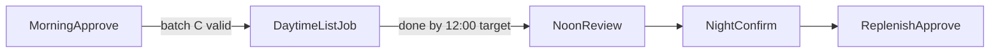
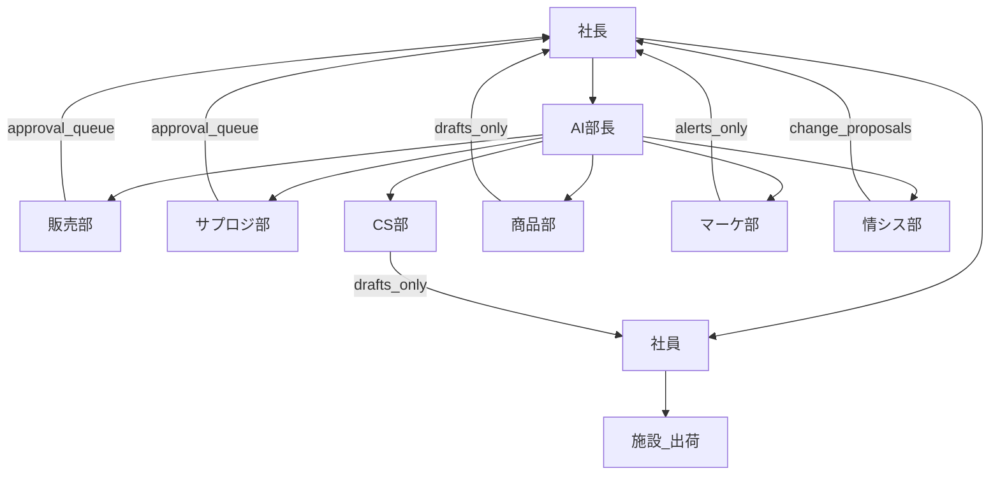

# AI 組織憲章（一人社長＋AI部門）

**文書種別**: 組織・運用の正（requirements）  
**最終更新**: 2026-07-15  
**実装**: 本フェーズでは **コード実装なし**（憲章＋承認マトリクスの確定と、その後の3者検証がゴール）  
**関連**: [AI_APPROVAL_MATRIX.md](AI_APPROVAL_MATRIX.md) ・ [LEVELLED_IMPLEMENTATION_PLAN.md](LEVELLED_IMPLEMENTATION_PLAN.md) ・ [AGENTS.md](../../AGENTS.md) ・ [CURRENT_PHASE.md](../CURRENT_PHASE.md)

---

## 1. 使命

社員数を増やさず、Amazon・楽天・Yahoo! の利益ある運営を継続しつつ、**難しい PC 判断・承認業務を社長の平日夜枠に収める**。AI は準備・定型実行・差し戻し検収を担い、不可逆操作と対外送信は人が最終ゲートを持つ。

「AI がすべて無人実行する」ではなく、**AI がすべて準備し、危険なものは承認後にだけ実行する**会社オペレーティングモデルとする。

---

## 2. 体制（変えないもの）

| 役割 | 稼働 | 責任 |
|------|------|------|
| 社長 | 平日のみ・夜約2時間（うち PC 目標は判断／承認中心で約1時間／日） | 方針・資本・最終承認・例外対応 |
| 社員1名 | 昼約5時間 | 施設連携・定型確認。減らしたい負荷: 顧客メール／在庫／問屋メール |
| 障がい者施設 | 出荷の約90% | 実出荷。連絡は LINE 主・不通時電話 |
| 戦略企画室（AI部長） | ルール＋承認キュー（人格ではなく仕組み） | 振り分け・検収表通過判定・差し戻し・社長向け承認一覧 |
| AI 各部門 | GAS／ドキュメント上のジョブ | 販売部・サプロジ部・CS部・商品部・マーケ部・情シス部（下表） |
| 情報システム部（情シス部） | Cursor 等での開発 | ツール開発・テスト手順。本番反映は承認後 |

人数は変えない。削減対象は **「難しい PC 作業が夜2時間に収まること」** である。

---

## 3. 日次リズム（確定）

| 帯 | 内容 |
|----|------|
| **朝（電車可）** | モバイルで在庫0/1出品バッチ等を承認。Googleログインの GAS Web を既定。操作性が悪い場合は LINE も可 |
| **日中（無人）** | 承認済みのみ出品実行。**原則12:00までに完了**し、12:00〜13:00に結果確認できること。承認後なら開始時刻は問わない |
| **夜（社長）** | 結果確認・失敗キュー・例外。翌日の補充／次バッチ準備 |
| **夜間ジョブ** | 準備・未返信下書き・メール振分要約・レポート寄り。出品本体の既定帯域は日中 |

バッチ有効期限は **(C) 明示取消まで有効**。ただし **実行直前に再チェック**（取消・必須欠落・レ点／承認リスト不一致など）を必須とする。  
冪等性: **同一バッチの再実行で成功済みSKUを重複出品しない**（実行済み管理。明示取消後の新規承認は別）。

| 項目 | 方針（社長決定 2026-07-15） |
|------|------------------------------|
| 朝バッチ等の承認権限 | **当面は社長のみ**（後で社員拡張可） |
| 実行前に「既に販売中（在庫>0）」 | **原則スキップ**（意図した補充は承認②のみ） |

補充（承認②）は flowchart の夜確認帯でも、**出品承認①とは別ゲート**（[AI_APPROVAL_MATRIX.md](AI_APPROVAL_MATRIX.md) §3）。タイミング表記はマトリクスを正とする。

---

## 4. 原則（憲法）

1. **当面は不可逆操作をすべて承認制**とする（自動送信・無承認の在庫付き販売開始を禁止）。承認権限は当面 **社長のみ**（§3）。
2. **お客様対応・メーカー／問屋対応の自動送信は禁止**。下書き生成・受信の振分／要約／緊急フラグは許可。
3. **出品は在庫0を原則**（買えない状態で掲載）。モール仕様または検証で不可なら **在庫1をフォールバック**。在庫1への切替は **承認画面に明示するか別承認**とし、無表示の自動切替はしない。いずれでも **販売可能数への引き上げ（補充）は別承認**。
4. 補充数は **`FLOOR(仕入数 ÷ セット数)`**（切捨て。余りは在庫に載せない）。
5. **失敗時に出品データを消さない**。在庫を付けない／補充しないで止める。部分成功時は **成功分を再実行せず、失敗側のみ最大2回リトライ**。
6. **検収の「100点」は人が書いたチェックリスト通過**を意味する。AI の自己採点は不合格扱い。
7. **楽天既存ロジック聖域・Yahoo 分離・B統合 Step 境界・シークレット非混入**は [AGENTS.md](../../AGENTS.md) §2 を継承する。実装制約（要約）: `generateRakutenCSV` を中心とする楽天完成経路は原則非改変、Yahoo は `Yahoo.js` 経由のみ、日中出品ジョブは **`B_INTEGRATED_STEP_FUNCTIONS` の順序・境界を変えない**（既存関数のラッパー呼び出しに留める）。
8. **docs を正とする**。部門ごとの成果物・参照は下の予定パスに置く（動画の「部門フォルダ」に相当）。

---

## 5. 組織図と部門役割

### 5.1 AI「社員」の定義

部門の AI は雇い人ではなく、次の三点セットを指す。

1. **ジョブ**（GAS 時間トリガー／メニュー実行）  
2. **プロンプト・ルール**（検収チェックリストを含む）  
3. **docs フォルダ**（当該部門の正・成果物置き場）

**AI部長**（正式名: 戦略企画室）も人格ではなく、**承認キュー＋検収表＋差し戻しルール**の総称である。社長への提出物は、AI部長を通った **承認待ち一覧／完了サマリ** に限定する（部門からの生ログ直投げはしない）。

### 5.1.0 用語対応（動画・Cursor ↔ 本憲章）

動画や Cursor でいう Agent／Subagent と、本憲章の部署モデルは **同じ概念の別呼び** である。業務の正は常に本憲章の部署名とする。

| 動画・製品での呼び方 | 本憲章での相当 | 備考 |
|----------------------|----------------|------|
| Orchestrator／部長エージェント | **AI部長（戦略企画室）** | 振り分け・検収・差し戻し・社長向けキュー |
| 部門エージェント | **販売部・サプロジ部・CS部・商品部・マーケ部・情シス部** | ドメイン単位。雇い人ではない（§5.1） |
| サブエージェント | **部署内の細ジョブ**（例: 画像のみ／在庫のみ／下書きのみ） | Phase0 では部署単位まで。細分化は Lv 別プラン以降 |
| Cursor Agent／Cloud Agent／Task Subagent | **情シス部の開発・レビュー道具** | コード・docs・3者検証用。日次の出品・承認ランタイムそのものではない |

日次の出品・承認の実行主体は当面 **GAS（時間トリガー等）** とする。Cursor 系 Agent は主に情シス部がツールを作る／直すときに使う。

### 5.1.1 部署名（確定・略称）

組織の詳細は後で組み直してよい。表示名は下表を正とする。

| 正式名 | 略称 |
|--------|------|
| 戦略企画室 | **AI部長** |
| 販売部 | （なし） |
| サプライチェーンロジスティクス部 | **サプロジ部** |
| CS部 | （なし） |
| 商品部 | （なし） |
| マーケティング部 | **マーケ部** |
| 情報システム部 | **情シス部** |

### 5.2 組織図

| 実線の意味 | 内容 |
|------------|------|
| 社長 → AI部長 | 方針・検収基準の更新。朝のバッチ承認は社長が直接行う（GAS Web） |
| AI部長 → 各AI部門 | ジョブ振り分け・不合格差し戻し・合格のみキューへ |
| 社員 → 施設 | 現場オペ・LINE／電話。AIは帳票・下書きで支援 |
| 各部門 → 社長／社員 | **送信禁止領域**は下書き止め。出品・補充は承認キューのみ社長へ |

### 5.3 部門ごとの役割（担当範囲／成果物／社長提出条件）

| 部門 | 担当範囲 | 成果物（例） | 社長へ提出してよい条件 |
|------|----------|--------------|------------------------|
| **戦略企画室（AI部長）** | キュー管理、検収表適用、差し戻し、日次サマリ | 承認待ち一覧、完了／失敗件数、未決事項 | 常時。他部門の生ログは要約後のみ |
| **販売部** | リサーチ連携、在庫0/1掲載、三モール出品準備・実行、補充案 | 掲載バッチ候補、実行結果、補充候補（`FLOOR(仕入÷セット)`） | 検収表通過かつ **朝バッチ承認対象**として整形済み |
| **サプロジ部** | 施設帳票、在庫スプレッド支援、後に倉庫アプリ | 出荷指示・差異リスト案 | 帳票は社員確認向け可。在庫アプリ本更新は要承認 |
| **CS部** | 未返信下書き、昼ワンボタン下書き、振分／要約／緊急フラグ | 下書き文面、緊急一覧 | **送信は提出しない**（下書きのみ。送信は人） |
| **商品部** | 問屋・メーカー向けメール下書き、見積候補整理 | 下書き文面、発注候補メモ | **送信は提出しない**。頻度は現状月数件でもルールは同じ |
| **マーケ部** | 既存シートルールに対する監視・逸脱検知 | アラート、週次要約 | **入札変更案はアラート止まり**（自動変更しない） |
| **情シス部** | ツール要件、実装レビュー、テスト手順、復元メモ | PR／差分説明、検証手順、CHANGE_LEDGER 案 | 本番反映提案まで。**`clasp push` 実行は当面社長** |

部門内の細分化は **Lv別プラン以降**でよい。Phase0 では上表の部署単位を正とする。

### 5.4 docs パス（予定）

| 部門 | docs パス（予定） |
|------|-------------------|
| 戦略企画室（AI部長） | `docs/org/`（**本ディレクトリ・初回実体**） |
| 販売部 | `docs/listing/`（後続） |
| サプロジ部 | `docs/inventory/`（後続。既存在庫アプリ docs と連携） |
| CS部 | `docs/cs/`（後続） |
| 商品部 | `docs/purchasing/`（後続） |
| マーケ部 | `docs/ads/`（後続。既存 `docs/広告運用_*.md` へリンク） |
| 情シス部 | `docs/is/`（後続。CHANGE_LEDGER 等と連携） |

**初回は `docs/org/` のみ作成する。** 空の部門フォルダは作らない（ノイズ防止）。後続フェーズで必要になったとき開設する。

操作の可否・承認帯の詳細は [AI_APPROVAL_MATRIX.md](AI_APPROVAL_MATRIX.md) を正とする。

---

## 6. 在庫・出品戦略（要約）

詳細な操作可否は [AI_APPROVAL_MATRIX.md](AI_APPROVAL_MATRIX.md) を正とする。

| 段階 | 内容 |
|------|------|
| 掲載 | 原則 **在庫0**。不可なら **在庫1**。朝承認→日中実行 |
| 区別 | 運用者の主眼はマスタ **在庫数**。システム判定は出品済ID等＋在庫を併用 |
| 補充 | 別承認後に `FLOOR(仕入数÷セット数)` をセットSKUごとに在庫へ反映 |
| Yahoo | 現行: マスタ「在庫数」→ `setStock`。補充は将来 **setStock のみ**を優先（全再出品しない） |
| 楽天 | 在庫数列を CSV 反映。0の見え方は要1SKU検証。代替は販売停止→極端価格 |
| Amazon | 自己発送。現状手入力→**在庫0/1バルク＋補充バルク**が3ヶ月必須範囲。高度APIは必須としない |

希望する見え方: **自分が確認できること**が第一。客から見えるが買えないが理想。モールにより不可なら販売停止／極端価格。

---

## 7. 実行基盤・コスト

| 項目 | 方針 |
|------|------|
| ジョブ実行 | **GAS 時間トリガー中心**（低コスト）。Cursor Cloud は開発・レビュー用 |
| Keepa | サブスク内のみ。トークン外の追加課金をしない |
| LLM | **Gemini を基本**。OpenAI は最小。夜間上限の目安 **1,000円／夜** |
| 失敗 | 自動リトライ **最大2回** → ログ＋**メール必須** |
| 本番 `clasp push` | 当面は人間（社長）。範囲・条件付き自動化は情シス部の後続フェーズ |

---

## 8. 3ヶ月の成功定義

**（b）三モール（楽天・Yahoo・Amazon）で、朝のモバイル承認を経た在庫0（または1）日中出品が平日安定稼働する。**

- 楽天／Yahoo: 既存自動化資産の延長で安定運用  
- Amazon: **バルクで手入力から脱却**（在庫0/1掲載と承認後の在庫更新）。APIの高度化は必須としない  
- 在庫アプリ本格・clasp自動push・広告自動入札は応援または次フェーズ  

---

## 9. 本フェーズの完了条件と次アクション

### 完了条件（Phase0）

- [x] 本憲章と [AI_APPROVAL_MATRIX.md](AI_APPROVAL_MATRIX.md) が docs にある  
- [x] **3者レビュー＋多数決**を実施（記録: [PHASE0_THREE_REVIEW_MAJORITY.md](PHASE0_THREE_REVIEW_MAJORITY.md)）し、採用項を正本へ反映  
- [ ] 社長が多数決メモを最終承認し、矛盾なしと判断した  
- [ ] **実装コードはまだ書かない**（次フェーズ）

### 次アクション（3者検証の手順）

**基本運用は [THREE_REVIEW_RUNBOOK.md](THREE_REVIEW_RUNBOOK.md)**（親1＋並列サブ最大3・別モデル・非共有。個別 Chat×3 の手コピペはしない）。

1. 親 Agent が RUNBOOK の子プロンプトで独立レビューを最大3本並列実行する。  
2. 親が **2/3以上採用・1票は未決** の多数決案を書く。  
3. 社長が最終承認後、採用を正本へ反映 → **Lv別プラン**（実装順序）へ。

### 本フェーズでやらないこと

- `Yahoo.js` / `コード.js` の改修、GAS Web 実装、本番出品ジョブ、Amazonバルク実装、`clasp push` 自動化  

---

## 10. 更新履歴

| 日付 | 内容 |
|------|------|
| 2026-07-15 | 3者多数決の採用項を反映（冪等・部分成功・在庫1承認明示・聖域1行・社長のみ／販売中スキップ）。§9 を RUNBOOK 基本運用へ更新。 |
| 2026-07-15 | §5.1.0 に動画・Cursor の Agent／Subagent と部署モデルの用語対応を追記（3者検証前）。 |
| 2026-07-15 | 部署名を確定名に置換（戦略企画室＝略称AI部長、販売部、サプロジ部、CS部、商品部、マーケ部、情シス部）。docsパスは変更なし。 |
| 2026-07-15 | §5 に組織図（mermaid）・AI社員定義・部門役割（担当／成果物／提出条件）を追記。3者検証前の可読性向上。 |
| 2026-07-15 | 初版。会話すり合わせ結果を正本化。実装なし。 |
