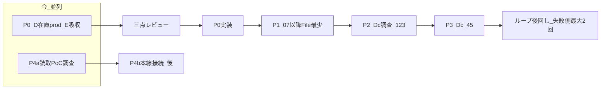

# Amazon 開発ロードマップ（P0〜P4／Dc）

**日付**: 2026-08-01  
**状態**: **確定**（P2調査完了＋**A/B/C方針ロック**。吉野家承認済）  
**親**: [D_MENU_AMAZON_FACADE_REQUIREMENTS.md](D_MENU_AMAZON_FACADE_REQUIREMENTS.md)（U0〜U7）／[LEVELLED_IMPLEMENTATION_PLAN.md](LEVELLED_IMPLEMENTATION_PLAN.md)／[AI_APPROVAL_MATRIX.md](AI_APPROVAL_MATRIX.md)  
**関連承認**: [LV4_D_P0_E_ABSORB_INVENTORY_APPROVAL.md](LV4_D_P0_E_ABSORB_INVENTORY_APPROVAL.md)／[LV4_AMAZON_CATEGORY_PT_POC_APPROVAL.md](LV4_AMAZON_CATEGORY_PT_POC_APPROVAL.md)／[LV4_P1_FILE_MIN_APPROVAL.md](LV4_P1_FILE_MIN_APPROVAL.md)／[LV4_P2_DC_123_INVESTIGATION_APPROVAL.md](LV4_P2_DC_123_INVESTIGATION_APPROVAL.md)（**§7.4 方針ロック**）

---

## 1. 前提（ロードマップ上は済）

| 領域 | 状態 |
|------|------|
| U0〜U4／U3 D入口／レ点本線／相乗り自己発 | 実機合格または実装済（**=レーンAの核**） |
| C1 HPC／SEASONING | 実装済（**=レーンB**）。七味＝吉野家承認済 |
| SCサマリ取込（Dc③の過渡） | 21-⑮温存 |
| Yahoo再認証半自動 | 済 |
| 人間並行（ブランド） | 吉野家承認済 → ライブ確認 |

---

## 1.1 出品レーン方針ロック（2026-08-01）

正本の詳細: [LV4_P2_DC_123_INVESTIGATION_APPROVAL.md](LV4_P2_DC_123_INVESTIGATION_APPROVAL.md) **§7.4**。

| レーン | 内容 | 今 |
|--------|------|-----|
| **A** | 既存カタログ → SP-API | **本開発の主** |
| **B** | 新規カタログ → xlsm＋SC人手 | **本番の正**・取り貯め |
| **C** | 新規 → JSON Listings | **ゲート後のみ**（1〜2PT） |

P2の xlsm①② API化・②単独ポーリング・今の新規JSON本線化は **しない**。

---

## 2. 確定順序

| ID | 内容 | 今やること | 三点 |
|----|------|------------|------|
| **P4a** | SP-API PT/Catalog・Keepaカテゴリ読取・Definitions取得・xlsm自動DL可否 | **P0と並列の最優先調査**（マスタ書込なし） | 不要（調査承認） |
| **P0** | 在庫0\|マスタ（既定0）・prod既定・dry_run折りたたみ・E→D吸収 | **1パッケージで三点**→承認後実装 | **必須** |
| **C-IA** | Cコース1本・①〜④逃げ道・E-1/E2一本化・U4はAmazon新規C-2のみ | P0後・**P1より前**（クリック削減） | **任意（今回スキップ）** |
| **P1** | 07白抜き後、ZIP以外 File 不要 | C-IA後 | 実装前承認（任意三点） |
| **P2** | Dc ①UP ②時間DL ③取込強化 | **調査＋方針ロック済**。xlsm①②は追わない。③は低優先。本開発は**レーンA** | 実装前に厳密承認 |
| **レーンA** | 既存カタログ SP-API 拡大 | **今の本開発主戦場**。先頭＝**A1 FBA** | 実装前承認 |
| **A1** | 相乗りFBA dry_run→少件prod | **検収OK**（属性込み） | **スキップ済** |
| **レーンB** | 新規 xlsm＋SC人手・取り貯め | **本番の正**（C1維持）。**台帳初版済** | — |
| **レーンC** | 新規 JSON Listings | **ゲート後のみ**（§1.1） | 別大型承認 |
| **P3** | Dc ④分析 ⑤バルク再作成 | レーンCまたは運用安定後。**①←⑤ループは後回し** | 同上 |
| **リトライ** | 失敗側のみ **最大2回**（マトリクス §5 維持。3回に改定しない） | docs明記のみ | — |
| **P4b** | カテゴリ／PTのマスタ書込・C1・D本線接続 | P4a成功後・P0/P1と衝突しない時期 | 実装前承認 |

---

## 3. 既存 Uチケットとの対応

| ファサード U | 本ロードマップ |
|--------------|----------------|
| U0〜U4／C1／U6(M2) | **前提済**（個別 HUMAN_RUN 正） |
| U5（ZIP自動） | 急がない。P1では ZIP 人間例外のまま。U5は別承認 |
| **U7（Dc）** | **P2＋P3** が U7 の中身。ループ接続はさらに後 |
| Eコース | **P0** で D に吸収（Z・単独は逃げ道残置） |

---

## 4. Dc ①〜⑤（要件文）

Seller Central／公式連携による掲載完了側（Da 人手の置き換え）。

1. **①** バルクファイルを SC（または公式経路）へアップロード  
2. **②** 処理結果を時間トリガーで取得  
3. **③** 処理結果を自動取り込み（状態・エラー要約）  
4. **④** 原因分析と対策立案（自動／半自動）  
5. **⑤** バルク再作成（GENERATED／PACKAGED）  

**ループ（後回し）**: 将来、⑤の後に①へ戻る。失敗側のみ **最大2回**（[AI_APPROVAL_MATRIX.md](AI_APPROVAL_MATRIX.md) §5 と同じ）。成功分は再実行しない。3回超えた時点で人間停止。

**過渡**: 監視フォルダ＋ファイル名による UPLOADED_OK（21-⑮系）は **Dc③の過渡・本番温存**。SC xlsm経路では②自動DLは不可のため、**人手08＋21-⑮**が当面の正（方針ロック §1.1）。

---

## 5. 対象／非対象（混同防止）

| フェーズ | 含む | 含まない |
|----------|------|----------|
| P4a | 読取PoC・件数制限・可否結論 | マスタ自動書込、D本番選定 |
| P0 | 在庫UI、prod既定、E吸収、関連docs | SC API、画像ドラッグ廃止、カテゴリ本線 |
| P1 | 07→02/U4自動化寄り | ZIP必須自動化 |
| P2 | ①②③調査・方針ロック | xlsm①②の実装追従、④⑤ループ、今の新規JSON全面 |
| レーンA | 既存カタログ PUT 拡大 | カタログ新規の JSON 全面 |
| レーンB | xlsm本線・エラー台帳 | APIによる xlsm UP |
| レーンC | ゲート後の1〜2PT JSON | ゲート前の本実装 |
| P3 | ④⑤の設計・段階実装 | 自動ループ（後） |

---

## 6. 次ゲート（人間）

1. ~~P1／P2調査／方針ロック~~ **済**（A本線／B取り貯め／Cゲート後）  
2. ~~レーンA1／FBA属性~~ **検収OK**（dry_run `…111613_41ce9e`／prod `…111845_6bd20f`）
2b. ~~デュアル Phase1~~ **検収OK**（dry+prod）— [承認§6.1](LV4_DUAL_OFFER_MFN_FBA_APPROVAL.md)
2b2. ~~**デュアル Phase2**~~ **検収OK**（dry+prod）— [承認§5](LV4_DUAL_OFFER_PHASE2_APPROVAL.md)／[HUMAN_RUN §3](D_MENU_DUAL_OFFER_PHASE2_HUMAN_RUN.md)
2c. ~~**A2**~~ **検収OK** — [承認](LV4_LANE_A2_OPS_HARDENING_APPROVAL.md)
2d. ~~**A3**~~ **dry／prod検収OK** — [承認](LV4_LANE_A3_MASTER_QTY_APPROVAL.md)（トグル戻しは人間）
3. （並列）~~七味／レーンB台帳~~ **台帳初版済** — [LANE_B_SC_ERROR_LEDGER.md](LANE_B_SC_ERROR_LEDGER.md)
4. A2運用固め → **A3**在庫>0（別承認）  
5. ~~**P4b**~~ **P4b-a／P4b-b合格** — [承認](LV4_AMAZON_CATEGORY_PT_P4B_APPROVAL.md)  
5b. ~~**レーンB B-T0**~~ **実装済／スモークOK** — [承認](LV4_LANE_B_BULK_TEMPLATE_T0_APPROVAL.md)  
5c. ~~**レーンB B-T1**~~ **dry_run 実装済／スモークOK** — [承認](LV4_LANE_B_BULK_TEMPLATE_T1_APPROVAL.md)
5d. ~~**レーンB B-T1 prod第2段**~~ **実装済／スモークOK** — [承認](LV4_LANE_B_BULK_TEMPLATE_T1_PROD_APPROVAL.md)／[HUMAN_RUN](D_MENU_LANE_B_BULK_T1_PROD_HUMAN_RUN.md)
5e. **レーンB B-T2** — **方針ロック済／三点スキップ**（実装は実需PT後）— [承認](LV4_LANE_B_BULK_TEMPLATE_T2_APPROVAL.md)／[HUMAN_RUN](D_MENU_LANE_B_BULK_T2_HUMAN_RUN.md)
6. （低優先）P2-③／（ゲート後）レーンC → P3

**2026-08-02**: **B-T2＋SHELF＋MAP** 実装、缶飯 UL#3＝100521待ち。七味は**出品中**（48h待ち解消）。D内レ点 clasp push済。

---

## 7. 更新履歴

| 日付 | 内容 |
|------|------|
| 2026-08-01 | 初版確定。P4a並列・P0一括三点・Dc①〜⑤・リトライ最大2回・ループ後回し。 |
| 2026-08-01 | P0コード実装済。次＝HUMAN_RUN＋P4a並列。 |
| 2026-08-01 | Cコース統合方針ロック（ドラッグ自動化・P1は後）。次＝C実装承認。 |
| 2026-08-01 | C検収OK。P4a PoC実装済。次＝P4a実機→P1。 |
| 2026-08-01 | P4a実機合格（Definitions/Catalog/xlsm結論）。次＝P1。 |
| 2026-08-01 | P1承認包起草〜検収OK。吉野家承認済。 |
| 2026-08-01 | P2調査承認包起草。 |
| 2026-08-01 | P2調査完了（①②API不可／③温存＋任意パース）。 |
| 2026-08-01 | **方針ロック**: レーンA/B/C（既存API本線／新規xlsm／JSONゲート後）。 |
| 2026-08-01 | **レーンA1** FBA承認包ドラフト。次ゲート＝A1。 |
| 2026-08-01 | A1 **方針承認**（prodまで・三点スキップ）。次＝実機。 |
| 2026-08-01 | **P4bコード実装**（21-⑱／C1マスタ優先・三点スキップ）。実機待ち。 |
| 2026-08-01 | **P4b方針ロック**（Catalog→既存Keepa browse→Definitions。C1本線SEASONING/HPC）。実装承認待ち。 |
| 2026-08-01 | **P4b承認包起草**（PT／browseマスタ・C1。手数料カテゴリ非対象）。方針待ち。 |
| 2026-08-01 | **デュアル Phase2検収OK**（dry `…f372b8`／`…40d85e`・prod `…8fcbc2`／`…cc7c72`）。 |
| 2026-08-01 | **デュアル Phase2コード実装**（チェック複数・自己発→FBA・部分成功）。実機待ち。 |
| 2026-08-01 | A1対比: MFN VALID／FBA 90220。**FBA属性承認包ドラフト**。 |
| 2026-08-01 | FBA属性 **方針承認**（§3折衷・三点スキップ）。次＝実装承認。 |
| 2026-08-01 | FBA属性 **実装**（compliance attrs＋失敗ダイアログ）。次＝push／実機。 |
| 2026-08-01 | **レーンB台帳初版**（シード済）。 |
| 2026-08-01 | **A3検収OK**（`…49a49e`／`…f677a3` MASTER）。レーンA一通り。 |
| 2026-08-01 | **A3承認包起草**（実機待ち）。自己発MASTER qty。 |
| 2026-08-01 | **A2検収OK**。次＝A3。 |
| 2026-08-01 | **A2承認包起草**（実機待ち）。次＝HUMAN_RUN実機→A3。 |
| 2026-08-01 | **デュアル検収OK**（prod `…4ed30e`／`…eb2511`）。次＝A2／A3。 |
| 2026-08-01 | **デュアル dry_run実機OK**（`…8fa79e`／`…d6ed67`）。prod未。次＝A2／A3。 |
| 2026-08-01 | **デュアル Phase1実装**（三点スキップ）。次＝マスタ列追加＋両系統 dry_run 検収。 |
| 2026-08-01 | **A1検収OK**（FBA dry_run／prod）。次＝A2／デュアル／A3。 |
