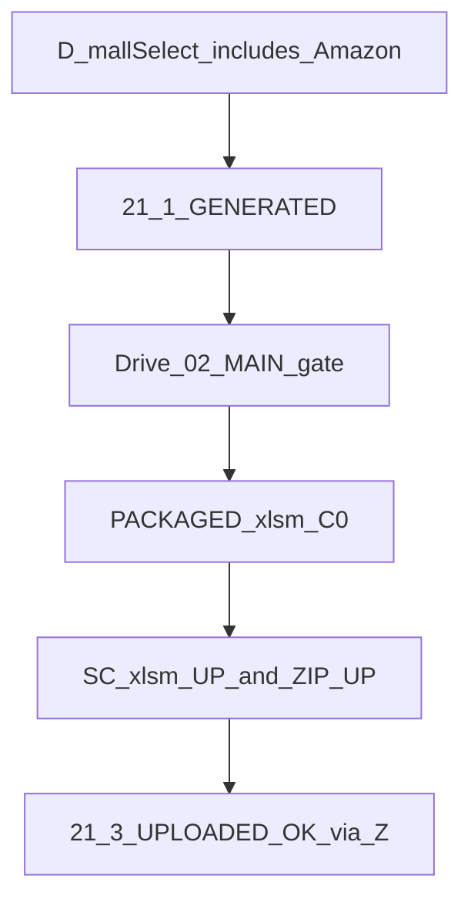

# Dメニュー Amazon 統合（本線ファサード）— 要件定義

**文書種別**: 要件定義（**U3 v1 実装済**・U0 **承認済＋3者反映済**）  
**最終更新**: 2026-07-25（U3 v1 実装）  
**状態**: U0クローズ。**U3 v1 実装済**（[D_MENU_U3_HUMAN_RUN.md](D_MENU_U3_HUMAN_RUN.md)）。[D_MENU_AMAZON_FACADE_THREE_REVIEW_MAJORITY.md](D_MENU_AMAZON_FACADE_THREE_REVIEW_MAJORITY.md)  
**親**: [LEVELLED_IMPLEMENTATION_PLAN.md](LEVELLED_IMPLEMENTATION_PLAN.md) ・ [AI_ORG_CHARTER.md](AI_ORG_CHARTER.md) ・ [AI_APPROVAL_MATRIX.md](AI_APPROVAL_MATRIX.md) ・ [LV4_AMAZON_ORCHESTRATION_REQUIREMENTS.md](LV4_AMAZON_ORCHESTRATION_REQUIREMENTS.md) ・ [LV4_R2_IMAGE_PIPELINE_POC.md](LV4_R2_IMAGE_PIPELINE_POC.md) ・ [BATCH_EXPORT_IMAGE_GATE_REQUIREMENTS.md](../BATCH_EXPORT_IMAGE_GATE_REQUIREMENTS.md) ・ [メニューとフロー_サマリー.md](../メニューとフロー_サマリー.md)  
**コード**: 本線 D = `コード.js` の `showBatchExportModal`／`runBatchExportAmazonFacade`。Amazon 入口の正は **D（Da）および Z → 21**（`AmazonApprovalExport.js`／`AmazonDriveImageExport.js`）。Amazon コースは **即時実行**（トリガー裏実行に載せない）。  
**ゴール一文**: 人間が見る本線は **A → B → C → D** のまま。**D のモール選択に Amazon を載せ**、中身は既存 **Lv4（メニュー21）** を呼ぶ薄いファサードにする。細かい再実行は **Z** に残す。当面の「完了」は **Da**（GENERATED＋画像ゲート＋**PACKAGED**＋SCの2手）まで。将来の掲載完了は **API連携必須**（Dc）。

---

## 1. 背景

AI出品ツールの思想は **メニュー最小・人間チェック最小**（楽天・Yahoo は A〜D 本線＋Z 分割）。  
Amazon Lv4 は SC・純正 `.xlsm`・画像 ZIP の都合で **Z → 21-①〜⑥** が細分化され、本線から外れて複雑に見えている。

本要件は **エンジンを一つに混ぜるのではなく、入口（D）を揃える** ことで思想に戻す。

---

## 2. スコープ

### 2.1 作るもの（要件として定義する成果）

| # | 成果物 | 実装チケット |
|---|--------|----------------|
| 1 | 本線／Z の役割分担の正本 | U0（本文書） |
| 2 | D モール選択に Amazon を含める UI／完了メッセージ仕様（Da） | U3 |
| 3 | D×Amazon が裏で呼ぶ既存 Lv4 入口（21-① 等）の契約 | U3（呼出のみ） |
| 4 | C（画像）を Amazon MAIN／サブ（REUSE）まで拡張する方針 | U2（詳細）→ 実装は別承認 |
| 5 | 段階 Da／Db／Dc と T3 条件（手ZIP正／自動化実装待ち） | U0 |

### 2.2 作らないもの（禁止）

- `generateRakutenCSV` 本体の改変（楽天聖域）  
- `Yahoo.js` 出品 API 本体の改変  
- B統合 `B_INTEGRATED_STEP_FUNCTIONS` の順序・境界変更  
- メニュー21の削除（Z 復旧用として残す）  
- D 実行だけで Seller Central へ無人 UP することの約束（Da では不可）  
- **T3（ZIP 自動）の独断実装**（§6.4・U5。別実装承認が必要）  
- xlsm 自動埋め（C1）の即実装  
- 承認②・販売中 SKU 無人上書き・`clasp push` 自動化  
- Dc（SC API）の即実装（将来必須だが別承認）  

### 2.3 聖域の守り方

```text
[D ファサード（U3）]
  → モール選択に amazon が含まれるときのみ
  → 既存 Lv4 公開入口（menuApprovalAmazonLv4Run 等＝21-①相当）を呼ぶ
  → 戻り値（runId／state／失敗理由）を表示する
  → 楽天CSV／Yahoo.js 本体には入らない
```

**薄いファサード契約（3者採用）**:

| D側でよい最小処理 | D側で禁止（エンジン混在） |
|-------------------|---------------------------|
| モール選択UI・完了／失敗メッセージ | GENERATED本体ロジックの再実装 |
| 承認①に `mall=amazon` が無いときの案内 | TRACK判定・抽出・状態シート更新の独自実装 |
| Drive `02` MAIN 有無ゲート（呼出前チェック可） | `generateRakutenCSV` / Yahoo 出品 API への介入 |
| 既存21関数への dispatch | 楽天／Yahoo 画像マッチング本体の破壊的改変 |

既存の手動 Amazon 手順（Z-21・PACKAGED・手 ZIP・SC）は **逃げ道として継続可**。

---

## 3. 前提

| # | 条件 |
|---|------|
| 1 | Lv1〜Lv3 人間検収済。Lv4 M1（HPC）および FOOD 試験クローズ済 |
| 2 | T2（21-⑥ Drive→R2 MAIN1枚）PoC 成功（runId `R2T2_20260724_221107_7f9cf7`） |
| 3 | Drive `04.amazonカタログ作成（CSV一括UL）` の 01〜06 配置済 |
| 4 | 本要件の社長承認（U0）→ 3者レビュー（§11）→ U3 は別実装承認 |

---

## 4. メニュー層

| 層 | メニュー | 役割 |
|----|----------|------|
| **本線（最小）** | A / B / C / **D** | 日常の「進める」。チェック最小 |
| **分割・復旧** | **Z**（18 承認①／19 楽天／20 Yahoo／**21 Amazon**） | 障害・部分やり直し・Property 付き PoC |

**現状（U3 前）**: Amazon の正入口は **Z → 21**。D は楽天・Yahoo 中心の一括（`showBatchExportModal`）。  
**U3 後**: D からも Amazon を選べる。21 は残す。

---

## 5. D のモール選択（案・U3 で実装）

| 選択 | 動き（概念） |
|------|----------------|
| 楽天のみ | 既存 D／必要なら Lv2 |
| Yahoo のみ | 既存 D／必要なら Lv3（子レ点） |
| 楽天 → Yahoo | 順次（現場順） |
| **Amazon のみ** | **Da まで**（§6） |
| 楽天＋Amazon 等 | 可。**Amazon 部分は Da で止まり**（SC手動が残る）。楽天側が完了しても Amazon は「準備完了／SC待ち」と表示差を出す（U3で固定） |

柔軟性: 「楽天だけ先」「あとから Yahoo」「Amazon は別日」を D の選択で表現する。  
Z からの 19／20／21 単独実行は禁止しない（上級・復旧）。

---

## 6. 完了定義（Da / Db / Dc）

Seller Central へ GAS が直接 UP できない前提のため、D×Amazon の「完了」を段階分けする。

### 6.1 Da（当面の正・U3 の検収対象）

D×Amazon = **準備完了まで**（掲載完了ではない）

**GAS／自動化側**

1. 承認① `mall=amazon` が無い場合は案内または Lv1 へ誘導（前提: ApprovalQueue の amazon 親＋子加算）  
2. **21-① 相当** GENERATED（裏は既存 Lv4。inventoryMode・25分分割は Lv4 側に委譲）  
3. Drive `02` に対象 `{SKU}.MAIN.jpg` があること（無ければ停止）  
4. （任意）21-⑥ 相当の R2（量産は U4）  

**人間作業（当面・明示）**

5. **PACKAGED**: 純正 `.xlsm` へ埋め（当面 Cursor／手＝C0。[LV4 §1.4](LV4_AMAZON_ORCHESTRATION_REQUIREMENTS.md) D-1）  
6. **SCの2手**（この2つのみを「SCの2手」と呼ぶ）  
   - PACKAGED `.xlsm` を SC「商品スプレッドシート」へ UP  
   - 画像 ZIP を Upload Images へ UP（**手 ZIP＝当面の正**。Drive `04`。命名例 `{親SKU}_MAIN_images_for_SC.zip`）  
7. 親子目視後 **21-③** `UPLOADED_OK`（当面 **Z**。将来 D から記録可は未決）  
8. Property トグルをオフに戻す（定常チェック）  

**将来**: 人間の SC UP／状態記録は **API連携必須**（§6.3 Dc）。Da の人手は当面の過渡形。

### 6.1.1 Da完了ダイアログ最低仕様（U3）

D×Amazon 完了時に少なくとも次を示す:

- GENERATED の `runId`／`subBatchId`（あれば）  
- PACKAGED の置き場案内（Drive `03` 等）  
- 手 ZIP の置き場・命名（Drive `04`）  
- SCの2手のチェックリスト  
- 「21-③は当面 Z」  
- `AMAZON_DRIVE_R2_UPLOAD_ENABLED`／`APPROVAL_AMAZON_LV4_ENABLED` を false に戻すこと  

### 6.2 Db（自動化予定・後）

- R2 URL → xlsm／GENERATED への自動埋め（U4）  
- ZIP 自動（U5＝T3。**実装承認待ち**・§6.4）  
- xlsm 自動（C1・[要件起草](D_MENU_C1_PACKAGED_XLSM_REQUIREMENTS.md)。次＝3者）  
- 日中トリガーで Da の GAS 側まで無人  

### 6.3 Dc（必須・将来）

- **Seller Central API（または公式連携）による UP／結果取得** … 社長確定: 将来必須。Da 人手は過渡。  
- 可能なら 21-③ 相当の自動記録  

### 6.4 T3（ZIP 自動）条件

**採用（3者＋社長）**:

- **手 ZIP＝当面の正**（Da 本線の画像投入）。  
- **T3＝ZIP作成の自動化**であり、着手は **「T2（R2 URL経路）だけでは SC 画像運用が成り立たない」ことが確定していること**を前提とする。  
- **既存証跡**: [LV4 §11.0](LV4_AMAZON_ORCHESTRATION_REQUIREMENTS.md)／§11.5.3 … R2 https 単独は **18320（メイン画像不足）になり得た** → ZIP優先クローズ。これを「T2だけでは足りない」確定証跡として扱う。  
- T3のコード実装はなお **別実装承認**（独断禁止）。反証（URL単独で安定成功）が出れば方針再検討可。  

### 6.5 フロー（Da）



---

## 7. C（画像紐付け）と Amazon

| 項目 | 方針（確定） |
|------|----------------|
| MAIN 紐付け | **案α**: `★画像AIマッチング(操作用)` の **子SKU行**で人間が白抜きを当てる（数量セットごと） |
| MAIN 出口 | Drive `04\02\{sellerSku}.MAIN.jpg`（GASコピー。手置きは例外） |
| MAIN 永続 | **マスタ列**。sheet 再生成後はマスタ→sheet 復元 |
| 白抜き候補 | **Amazon 用ソースフォルダ**（楽天と分離） |
| サブ | REUSE＝マスタ楽天サブ。ONLY PT＝**sheet 本線** |
| UI | **案α**。将来 **ε** はバックログ |
| 詳細 | [D_MENU_U2_C_AMAZON_IMAGE_REQUIREMENTS.md](D_MENU_U2_C_AMAZON_IMAGE_REQUIREMENTS.md)（三点＋社長回答反映済） |
| 多数決 | [D_MENU_U2_THREE_REVIEW_MAJORITY.md](D_MENU_U2_THREE_REVIEW_MAJORITY.md) |
| 設計参照 | [LV4_R2_IMAGE_PIPELINE_POC.md](LV4_R2_IMAGE_PIPELINE_POC.md) §2.1 |

C（sheet）→ マスタ永続 → `02` コピー → D×Amazon、が理想。

**現状**: U2／U3 実機済。T2再検証合格。次＝**U4 実装承認**（[U4要件](D_MENU_U4_R2_URL_EMBED_REQUIREMENTS.md)）。

---

## 8. 既存 D・Lv4 との関係

| 入口 | 現状 | U3 後 |
|------|------|--------|
| D `showBatchExportModal` | 楽天・Yahoo 一括（画像ゲートあり） | Amazon 選択肢追加。裏は Lv4 呼出 |
| Z → 21 | Amazon の正入口 | **残す**（分割・復旧・21-⑥ PoC） |
| Lv4 要件 | GENERATED→PACKAGED→SC→UPLOADED_OK | エンジン仕様の正本のまま。本線 UX は本文書 |

相互参照: [LV4_AMAZON_ORCHESTRATION_REQUIREMENTS.md](LV4_AMAZON_ORCHESTRATION_REQUIREMENTS.md) §10。

---

## 9. 実装チケット

| ID | 内容 | 依存 | 状態 |
|----|------|------|------|
| **U0** | 本要件書 | — | **承認済＋3者反映済** |
| **U1** | CURRENT_PHASE／AGENT_HANDOVER／CHANGE_LEDGER／LV4・POC 相互リンク | U0 文書化 | **済** |
| **U2** | C: Amazon MAIN／サブ（REUSE）詳細要件1枚 | U0 | **三点＋社長回答反映済** → [U2要件](D_MENU_U2_C_AMAZON_IMAGE_REQUIREMENTS.md)／[MAJORITY](D_MENU_U2_THREE_REVIEW_MAJORITY.md)。**次＝実装承認** |
| **U3** | D UI: モール選択に Amazon・Da 完了メッセージ。裏は 21-① 等呼出 | U0＋3者反映 | **v1 実機合格**（2026-07-25。[HUMAN_RUN](D_MENU_U3_HUMAN_RUN.md)） |
| **U4** | 画像量産 R2／GENERATED・マスタへの URL 書き（xlsm直編集はC1） | U2・T2・T2再検証合格 | **実機合格** → [HUMAN_RUN §0](D_MENU_U4_HUMAN_RUN.md) |
| **C1** | PACKAGED xlsm ほぼ自動（ローカル／Cursor） | U4・HPC | **要件起草** → [C1要件](D_MENU_C1_PACKAGED_XLSM_REQUIREMENTS.md)／[承認包](LV4_C1_IMPLEMENTATION_APPROVAL.md)。**次＝3者** |
| **U5** | T3 ZIP 自動 | §6.4。T2再検証後は **急がない** | 保留 |
| **U6** | M2／21-⑤ 等 | **M2 v1実装済**（案L・発汗試験定義）。実機は [D_MENU_M2_HUMAN_RUN.md](D_MENU_M2_HUMAN_RUN.md) | 実機待ち |
| **U7** | Dc: SC API 連携（将来必須） | Da運用安定後 | 未 |

U3 着手時は必ず **変更予定ファイル一覧／概要／リスク** を提示し社長承認を得る（新規ファイル・複数ファイル・EC 関連の可能性）。

---

## 10. 人間に残すチェック（Da・最小）

**定常（Da外だが毎回）**

1. 承認①（朝ハンコ）  
2. `02` に MAIN（必要ならサブ／PT）があるか（C 後）  
3. 21-③ 後に Property トグル off  

**人間作業（Da・当面）**

4. **PACKAGED**（xlsm＝C0）  
5. **SCの2手**（xlsm UP ＋ ZIP UP）  
6. 親子目視 → 21-③（Z）  

列マッピング細部・HMAC・Folder ID は裏／Z。将来 Dc（API）で 4〜6 を縮減する。

---

## 11. 3者レビュー（実施済）

実施済: [D_MENU_AMAZON_FACADE_THREE_REVIEW_MAJORITY.md](D_MENU_AMAZON_FACADE_THREE_REVIEW_MAJORITY.md)（2026-07-24／反映 2026-07-25）。  
再レビューが必要な大幅改訂時は [THREE_REVIEW_RUNBOOK.md](THREE_REVIEW_RUNBOOK.md) に従う。

---

## 12. 検収

### 12.1 要件フェーズ

- [x] 本文書が org に存在し、CURRENT_PHASE §0 から参照される  
- [x] 社長 U0 承認（T3前提・Da明示・MAJORITY配置）  
- [x] 3者レビュー多数決の反映  

### 12.2 U3 実装フェーズ（別承認後）

- [x] D で Amazon を選べる（`amazon` / `full_amazon`）  
- [x] 選択時に GENERATED（21-①）が走り、`02` 欠落で止まる（POC_SKU 設定時は厳格／未設定はフォルダ到達＋人間確認）  
- [x] 完了ダイアログが §6.1.1 を満たす（PACKAGED＋SCの2手）  
- [x] 楽天 CSV／Yahoo.js 差分なし（呼出のみ）  
- [x] Z-21 が従来どおり動く  
- [x] D側に GENERATED 本体の複製がない（薄いファサード）  
- [x] 人間: `clasp push` → D 実機確認（[HUMAN_RUN](D_MENU_U3_HUMAN_RUN.md)）— **2026-07-25 合格** `runId=LV4_20260725_072635_948892`

---

## 13. 承認コメント例（記録）

> **U0 承認（2026-07-25）**: Amazon も本線は A〜D。D のモール選択に Amazon。完了は当面 Da（PACKAGED＋SCの2手）。手ZIP＝当面の正／T3＝自動化実装待ち（§11.0 18320をT2不足の既存証跡）。将来 API連携必須。21 は Z に残す。U3は別承認。

> **U3 v1 承認（2026-07-25）**: Dに amazon コース追加。裏は menuApprovalAmazonLv4Run 呼出のみ＋Da完了ダイアログ（§6.1.1）。複合は任意でフル後に Amazon Da 止まり。21-③・T3・Yahoo.js・楽天CSV・B統合は触らない。トリガー裏実行に Amazon を載せない。

> **U2-0 方針（2026-07-25）**: 本線案α。MAIN＝マッチングsheet・子SKU行で人間紐付け。`02`＝出口。サブ REUSE／ONLY。ε＝バックログ。実装は別承認。

> **U2 三点＋社長（2026-07-25）**: ONLY PT＝sheet（`02`手置き＝例外）。永続＝マスタ／再生成後復元。候補＝Amazon用フォルダ。MAJORITY保存＋要件・POC整合。

---

## 14. 更新履歴

| 日付 | 内容 |
|------|------|
| 2026-07-26 | **C1要件リンク**（ローカル本線・次＝3者）。 |
| 2026-07-26 | **U4要件＋承認パッケージ**リンク。U2/U3済・T2再検証後。T3急がない。 |
| 2026-07-25 | U2三点＋社長回答を§7・チケットに反映。MAJORITYリンク。 |
| 2026-07-25 | U2 §7: MAIN紐付け＝案α・εバックログを反映。 |
| 2026-07-25 | **U3 v1 実装＋実機合格**。U2要件へリンク。HUMAN_RUN追加。 |
| 2026-07-25 | 三点多数決反映。PACKAGED明示・SCの2手定義・T3＝手ZIP正／自動化待ち・薄いファサード契約・Dc必須・ダイアログ最低仕様。 |
| 2026-07-24 | 初版。Ask U0 案を要件定義化。コード実装なし。 |
