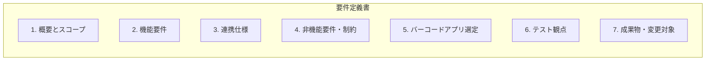

# 在庫管理アプリ pic2shop 連携 要件定義書

## ドキュメント構成



---

## 1. 概要とスコープ

### 1.1 目的

- GAS で運用している在庫管理 Web アプリを**主**のまま、スマートフォンで**バーコードスキャン**を利用できるようにする。
- ブラウザ内カメラが利用できない環境（Android Chrome / iOS 等）を避け、**pic2shop** を用いて JAN を取得し、GAS に渡す。

### 1.2 背景

- 現状、GAS のカメラスキャンは script.google.com 上で許可ダイアログが出ず利用できない。
- 「出荷メニューを開く → スキャン → GAS に戻る」という **AppSheet に近い操作フロー** を、GAS + pic2shop で実現する。

### 1.3 対象画面

次の**全画面**で、URL パラメータによる JAN 受け取りおよび pic2shop 連携の対象とする。

| 画面ID | 画面名 |
|--------|--------|
| receiving | 入荷 |
| shipping | 出荷 |
| move | 在庫移動 |
| count | 棚卸 |
| adjust | 棚卸確定後修正（確定後修正） |
| products | 商品情報 |

### 1.4 対象端末・環境

- **端末**: Android / iPhone（スマートフォン）。タブレット・PC は対象外としないが、優先はスマホ。
- **GAS Web アプリ URL**: 本番用 **1 つに固定** する。
- **前提**: 利用者は **pic2shop を端末にインストール済み** であること。

### 1.5 対象外

- GAS の在庫ロジック・スプレッドシート構造・既存 API の変更は行わない（URL パラメータ受け取りと画面側の初期処理・リダイレクトの追加に限定する）。

---

## 2. 機能要件

### 2.1 URL パラメータの受け取り（GAS 側）

- **doGet(e)** で次を受け取る。
  - **view**: 表示する画面。`receiving` / `shipping` / `move` / `count` / `adjust` / `products` のいずれか。不正値の場合は既存どおり `shipping` にフォールバックしてよい。
  - **jan**: スキャンした JAN（pic2shop の callback で付与される）。
- 受け取った **view** に応じて該当画面を表示する。
- 受け取った **jan** を、該当画面の **JAN 入力欄の初期値** としてクライアントに渡す（テンプレート変数などで渡し、HTML 側で input の value にセットする）。

### 2.2 初期表示時の挙動（JAN が渡されている場合）

- 該当画面の JAN 入力欄に **jan** をセットする。
- セット後、**自動で lookup（マスタ参照）** を実行し、既存仕様どおり次の項目を埋める。
  - 商品名・箱入数・仕入単価 等（画面ごとの既存項目に準拠）。
- 自動で埋めた項目は **手修正可能** な状態のままとする（既存の入力・選択 UI を変更しない）。

### 2.3 初期表示時の挙動（JAN が渡されていない場合・対象画面を開いた場合）

- **対象画面**（入荷・出荷・在庫移動・棚卸・棚卸確定後修正・商品情報）のいずれかを表示したとき、URL に **jan** が含まれていなければ、**自動で pic2shop を起動する URL にリダイレクト** する。
- リダイレクト先は、**現在表示している view** に対応した callback を持つ pic2shop 起動 URL とする。
- これにより「**出荷メニューを開く → pic2shop が開く → スキャン → GAS に戻る**」というフローを実現する。

### 2.4 手入力のための措置

- スキャンを使わず **手入力** したい場合に備え、対象画面に **「手入力」** ボタン（または同等の操作）を設ける。
- 「手入力」操作時は **pic2shop へのリダイレクトを行わず**、JAN 入力欄にフォーカスするなど、手入力に適した動作とする。
- リダイレクトのトリガーは「**対象画面の表示かつ URL に jan が無い**」ときに限り実行し、「手入力」操作後は同一セッション内で再度リダイレクトしない等、**手入力と両立** するようにする。

### 2.5 ログイン・アクセス許可

- URL で開いた場合も、**既存どおり**「ログイン済みユーザーのみ」とする。
- 未ログイン・アクセス不可の場合は、**既存どおり** のエラー画面（「アクセス権がありません」）を表示する。変更なし。

### 2.6 登録後の動作

- 入荷・出荷・その他対象画面で **登録成功後** は、**フォームをリセット** し、**先頭（JAN 入力欄など）にフォーカス** する。既存の入荷でのリセット仕様に合わせる。

---

## 3. 連携仕様（pic2shop）

### 3.1 pic2shop の役割

- **起動**: GAS（ブラウザ）から **pic2shop の URL スキーム** を開くことで起動する。
- **スキャン**: 利用者がバーコードをスキャンする。
- **コールバック**: スキャン後、**callback パラメータで指定した URL** を開く。URL 内の **EAN** は、pic2shop が**スキャン結果（JAN）に置換**する。開く先は**ブラウザ**（GAS の画面が開く）。

### 3.2 pic2shop 起動 URL の形式

- 形式（概念）:
  ```
  pic2shop://scan?callback=ENCODED_CALLBACK_URL
  ```
- **CALLBACK_URL** は GAS の Web アプリの実行 URL とし、クエリに **view** と **jan=EAN** を含める。
  - 例（エンコード前）:  
    `https://script.google.com/macros/s/（デプロイID）/exec?view=shipping&jan=EAN`
  - **EAN** は pic2shop がスキャン結果に置換するためのプレースホルダー。実際の URL では **EAN** のまま（置換は pic2shop が行う）。
- 本番の GAS URL は **1 つに固定** し、view のみ画面に応じて変更する（receiving / shipping / move / count / adjust / products）。

### 3.3 リダイレクトのタイミング

- 対象画面を表示したとき、**URL に jan が含まれていない** 場合にのみ、上記 pic2shop 起動 URL へ **リダイレクト** する。
- **jan が含まれている** 場合（pic2shop から戻ってきた場合）はリダイレクトせず、2.1・2.2 のとおり JAN をセットして lookup を実行する。

### 3.4 ユーザー操作フロー（想定）

1. 利用者が **GAS を開き、出荷（または入荷等）メニューを選択** する。
2. **jan が無い** ため、**pic2shop を起動する URL へリダイレクト** し、pic2shop が開く。
3. 利用者が **バーコードをスキャン** する。
4. pic2shop が **callback URL（view + jan を付与）** を開き、**GAS の該当画面がブラウザで表示** される。
5. GAS 側で **JAN がセットされ、lookup が実行済み** の状態となる。必要に応じて手修正する。
6. 数量・ロケーション等を入力し、**登録** する。
7. 登録後、**フォームがリセットされ、先頭にフォーカス** する（次のスキャン or 手入力に備える）。

---

## 4. 非機能要件・制約

### 4.1 既存仕様の維持

- 在庫ロジック・スプレッドシート・既存 API・アクセス許可・ログイン判定は **変更しない**。
- 追加するのは次のみとする。
  - doGet における **view / jan** の受け取りとテンプレートへの受け渡し。
  - クライアント側の **初期値セット・lookup 自動実行・リダイレクト・手入力ボタン・登録後リセット**。

### 4.2 セキュリティ・運用

- **HTTPS** の GAS Web アプリのままとする。
- アクセス許可は **既存の「アクセス許可」シート** のままとする。変更なし。
- pic2shop の callback には **本番の GAS URL のみ** を使用する（固定 1 つ）。

### 4.3 前提条件

- 利用者は **pic2shop（無料版）をインストール済み** であること。
- **Android / iOS** のいずれでも、pic2shop が callback URL をブラウザで開く動作をすること（実機で確認する）。

---

## 5. バーコードアプリ選定

### 5.1 採用アプリ: pic2shop（無料版）

- **スキャン後に URL を開く**: callback パラメータで GAS の URL を指定でき、EAN をスキャン結果に置換できる。
- **ブラウザから起動**: `pic2shop://scan?callback=...` で起動できる。
- **Android / iOS 両対応**: 同一の URL スキーム・callback 仕様で両 OS に対応可能。
- **無料**: 無料版で上記が利用可能であることを前提とする。

---

## 6. テスト観点

### 6.1 正常系

- 各対象画面（receiving / shipping / move / count / adjust / products）で、**?view=（画面ID）&jan=（テスト用JAN）** を付与して GAS を開いたとき、
  - 該当画面が表示されること。
  - JAN 入力欄に指定した JAN が入っていること。
  - 自動で lookup が実行され、商品名・箱入数・仕入単価等が既存仕様どおり埋まること。
  - それらを手修正できること。
  - 登録後、フォームがリセットされ、先頭にフォーカスすること。
- **jan を付けずに対象画面を表示** したとき、
  - pic2shop を起動する URL へ **リダイレクト** すること（実機で pic2shop が起動すること）。
- pic2shop でスキャンし、GAS に戻ったとき、
  - 指定した view の画面が開き、JAN がセットされ lookup が実行されていること。
- **「手入力」** 操作時、リダイレクトせず JAN 欄にフォーカス等、手入力しやすい動作になること。

### 6.2 異常系・境界

- **未ログイン** で callback URL（view + jan 付き）を開いた場合、既存どおり **アクセス権エラー画面** が表示されること。
- **view が不正または未指定** の場合、既存どおりのフォールバック（例: shipping）で表示されること。

### 6.3 端末・環境

- **Android** で、GAS → pic2shop → スキャン → GAS に戻る一連の流れが動作すること。
- **iOS** で、同様の流れが動作すること。

---

## 7. 成果物・変更対象

| 対象 | 内容 |
|------|------|
| **Code.gs** | doGet で **view**・**jan** を取得し、テンプレートに渡す。既存ロジックは変更しない。 |
| **index.html（テンプレート）** | サーバーから渡された **view**・**jan** を受け取り、該当画面の JAN 入力欄に初期値をセットする。ページ読み込み時に **jan が存在すれば lookup を実行** する。**jan が無く対象画面なら pic2shop 起動 URL へリダイレクト** する。**「手入力」ボタン** を追加し、リダイレクトをスキップして JAN 欄にフォーカスする。登録後の **フォームリセット・先頭フォーカス** は既存＋必要に応じて対象画面を拡張。 |
| **本番 GAS URL** | 1 つに固定し、pic2shop の callback およびリダイレクト先に使用する。 |

### 7.1 用語・参照

- **lookup**: 既存の `apiLookupProduct` 等を用いたマスタ参照（商品名・箱入数・仕入単価等の取得）。
- **対象画面**: 本要件で URL 連携の対象とする 6 画面（入荷・出荷・在庫移動・棚卸・棚卸確定後修正・商品情報）。
- **pic2shop**: 本要件で採用するバーコードスキャンアプリ（無料版）。公式: https://www.pic2shop.com/

---

*以上、在庫管理アプリ pic2shop 連携の要件定義とする。実装の進め方および早期検証（PoC）は [在庫管理アプリ_pic2shop連携_開発プロセス.md](在庫管理アプリ_pic2shop連携_開発プロセス.md) を参照すること。*
