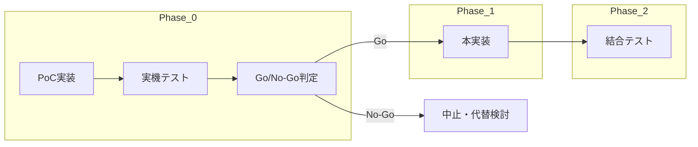

# 在庫管理アプリ pic2shop 連携 開発プロセス

## 目的

- [在庫管理アプリ_pic2shop連携_要件定義書.md](在庫管理アプリ_pic2shop連携_要件定義書.md) に基づき、pic2shop 連携機能を実装する。
- **作り込んでから pic2shop が使えなかった** というリスクを避けるため、**Phase 0: スキャニング PoC** で pic2shop の可否を早期に判断し、**Go の場合のみ** 本実装（Phase 1）に進む。

## フェーズ概要

---

## Phase 0: pic2shop スキャニング PoC（早期検証）

### 目的

本実装前に、**pic2shop が「ブラウザから起動 → スキャン → callback で GAS に JAN を渡す」まで動くか** を実機で確認し、開発を進めるかどうか判断する。

### 成果物

- **スキャニングテスト用画面**: 本番と同じ GAS プロジェクト内で、`?test=1` または `view=scantest` で表示する**単独のテストページ**。
  - **表示内容**:
    - 「pic2shop 動作確認テスト」のタイトル。
    - 現在の GAS の URL（callback のベース）。
    - 「pic2shop でスキャン」リンク（`pic2shop://scan?callback=ENCODED_CALLBACK`）。
  - **callback URL**: 当該 GAS の実行 URL（`https://script.google.com/macros/s/.../exec`）に `?test=1&view=scantest&jan=EAN` を付与したものをエンコードする。**EAN** は pic2shop がスキャン結果に置換するため、URL 内では文字列 **EAN** のままエンコードする。
  - **jan 付きで開かれた場合**: ページに「受信した JAN: （値）」を表示し、「スキャン → GAS に戻り JAN が渡る」ことを確認できるようにする。

### 実装範囲

- **[inventory-app/Code.gs](inventory-app/Code.gs)**: doGet で `params.test === '1'` または `params.view === 'scantest'` のとき、アクセス許可はそのまま使い、**テスト用の最小 HTML**（テンプレート変数: baseUrl, jan）を返す。既存の index は触れない。
- **テスト用 HTML**: 別ファイル（例: `scantest.html`）または doGet 内の `createHtmlOutput` で最小限の HTML を出力する。

### テスト手順

1. スマートフォンに **pic2shop** をインストールする。
2. GAS を「テスト用」でデプロイする（または既存デプロイで `?test=1&view=scantest` を開く）。
3. 表示された **「pic2shop でスキャン」** をタップし、pic2shop が起動するか確認する。
4. バーコードをスキャンし、ブラウザで GAS が再度開き、**「受信した JAN: xxx」** が表示されるか確認する。
5. **Android と iOS の両方** で上記 1〜4 を実施する。

### Go/No-Go 判定基準

| 判定 | 条件 |
|------|------|
| **Go** | 上記 3〜4 が **Android・iOS の両方** で成立し、JAN が GAS に渡ること。 |
| **No-Go** | pic2shop が起動しない、スキャン後に GAS に戻らない、JAN が渡らない、のいずれか。 |

**No-Go の場合**: 本実装（Phase 1）は行わず、別アプリの検討や運用案（手入力のみ等）に切り替える。

### 工数目安

- PoC 実装: **1〜2 時間程度**（テスト用 HTML + doGet 分岐のみ）。
- 本実装は **Phase 0 が Go と判定された後に** 実施する。

### 注意事項

- PoC 用の **scantest** は、本番の通常画面一覧（出荷・入荷など）には出さない。`?test=1` または `view=scantest` でだけ表示する。
- pic2shop の callback に渡す URL は、**デプロイ後の実行 URL**（`https://script.google.com/macros/s/.../exec`）をベースにし、クエリ `test=1&view=scantest&jan=EAN` を付与する。EAN は pic2shop がスキャン結果に置換するため、URL 内では文字列 **EAN** のままエンコードする。

---

## Phase 1: 本実装（Phase 0 が Go の場合のみ）

### 前提

- Phase 0 の **Go/No-Go 判定が Go** であること。
- テスト用分岐（scantest）は **残してよい**（削除しなくてよい）。

### 実装ステップ

1. **[inventory-app/Code.gs](inventory-app/Code.gs)**  
   - doGet で **params.jan** を取得し、テンプレートに渡す（既存の `html.view` と同様に **html.jan** をセットする）。

2. **[inventory-app/index.html](inventory-app/index.html)**  
   - サーバーから渡された **jan** を、各対象画面の **JAN 入力欄の初期値** にセットする。
   - ページ読み込み時、**jan が存在すれば lookup** を実行する。
   - **対象画面** かつ **jan が無い** 場合は、pic2shop 起動 URL へ **リダイレクト** する。
   - **「手入力」ボタン** を設け、リダイレクトをスキップして JAN 欄にフォーカスする。
   - 登録後の **フォームリセット・先頭フォーカス** は、既存仕様に合わせて対象画面で拡張する。

3. **本番 GAS URL**  
   - **1 つに固定** し、pic2shop の callback およびリダイレクト先に使用する。

詳細な機能要件・連携仕様は [在庫管理アプリ_pic2shop連携_要件定義書.md](在庫管理アプリ_pic2shop連携_要件定義書.md) の「成果物・変更対象」および各セクションに従う。

---

## Phase 2: 結合テスト・受入

### 確認項目

- [要件定義書 6. テスト観点](在庫管理アプリ_pic2shop連携_要件定義書.md#6-テスト観点) に沿って次を確認する。
  - 各 view で **?view=xxx&jan=yyy** を付与したときの表示・lookup・手修正・登録・リセット。
  - **jan なし** で対象画面を開いたときの **リダイレクト**。
  - **「手入力」** 操作時、リダイレクトせず手入力できること。
  - **未ログイン** で callback URL を開いたときの **エラー表示**。
- **Android・iOS** の両方で、「出荷（または他対象画面）を開く → pic2shop が開く → スキャン → GAS に戻る」の一連の流れを確認する。

### 完了条件

- 要件定義書の「テスト観点」を満たし、Android・iOS で pic2shop 連携が期待どおり動作すること。
- 受入条件を満たした時点で Phase 2 完了とする。

---

## 参照

- **要件定義書**: [在庫管理アプリ_pic2shop連携_要件定義書.md](在庫管理アプリ_pic2shop連携_要件定義書.md)
- 実装時の変更対象: [inventory-app/Code.gs](inventory-app/Code.gs)、[inventory-app/index.html](inventory-app/index.html)

---

*以上、pic2shop 連携の開発プロセスとする。Phase 0 の PoC 実装 → 実機テスト → Go/No-Go 判定ののち、Go の場合に Phase 1 を実施すること。*
