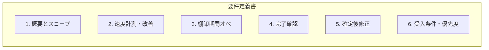

# 在庫管理アプリ 棚卸期間・速度・確定後修正 要件定義書

## ドキュメント構成

---

## 1. 概要とスコープ

### 1.1 対象

- **対象システム**: 在庫管理アプリ（GAS Webアプリ）の棚卸まわりおよびアプリ全体の体感速度。
- **対象読者**: 開発担当・ステークホルダー。実装前の仕様確定と受入基準の共有用。

### 1.2 前提

- 既存の「スタート／完了」と棚卸セッションによる期間中ロジックは**実装済み**である。
- 計算ロジックの詳細は [在庫管理アプリ_現在庫と差異の計算ロジック.md](在庫管理アプリ_現在庫と差異の計算ロジック.md) のセクション 7（7.0〜7.7）を参照すること。
- データ構造（棚卸セッション・棚卸スキャンリスト）は [在庫管理アプリ_引き継ぎ仕様.md](在庫管理アプリ_引き継ぎ仕様.md) を参照すること。

### 1.3 本要件で行うこと

| 項目 | 内容 |
|------|------|
| ① 速度 | 挙動ごとの速度計測を可能にし、改善ポイントを洗い出す。 |
| ② 棚卸期間 | 「棚卸期間」オペレーションとして運用を整理し、月跨ぎ・確定値の扱いを明示する。 |
| ③-1 完了確認 | 棚卸「完了」押下時に確認ダイアログを表示し、はい/いいえで確定する。 |
| ③-2 確定後修正 | 棚卸確定後に前回棚卸への加算・減算ができるメニューを設ける。 |

---

## 2. 速度計測と改善（①）

### 2.1 要件

- アプリの**挙動ごとに**速度を計測し、改善ポイントを特定できるようにする。
- 計測結果は開発・調査時に参照できる形で残す（ログまたはデバッグ用表示）。

### 2.2 計測対象（挙動）一覧

| 挙動 | 計測の単位 | 備考 |
|------|------------|------|
| 初回表示 | doGet の HTML 返却〜loadMasters 完了 | 場所・理由・担当者マスタの取得を含む |
| タブ切替（差異） | loadVariance の開始〜終了 | 差異一覧の取得 |
| タブ切替（在庫） | loadStock の開始〜終了 | 現在庫一覧の取得 |
| JAN 入力（blur） | apiLookupProduct の開始〜終了 | 商品名・箱入数などの参照 |
| 棚卸保存 | apiLookupProduct ＋ apiCount の一連 | 2 回の API 呼び出しを含む |
| 棚卸スタート | apiCountStart の開始〜終了 |  |
| 棚卸完了 | apiCountComplete の開始〜終了 |  |
| 出荷登録 | apiShipping の開始〜終了 |  |
| 入荷登録 | apiReceiving の開始〜終了 |  |
| 在庫移動登録 | apiMove の開始〜終了 |  |
| 商品登録 | apiProductAdd の開始〜終了 |  |

### 2.3 計測方法

- **クライアント側**: 各挙動の開始・終了で `performance.now()` を取得し、「操作名」「所要時間(ms)」を記録する。
  - 出力先: `?log=1` 付きで表示するデバッグエリア、または `console.log`。
- **サーバー側（任意）**: 主要 API の先頭・末尾で時刻を取得し、処理時間を Logger またはデバッグ用シートに出力する。
  - クライアント計測と組み合わせて、遅延が「ネット往復」か「GAS 内処理」かを切り分けるために使用する。

### 2.4 改善ポイント一覧（方向性）

実装フェーズでは、計測結果に基づき遅い挙動から順に対応する。以下は改善の方向性の例である。

| 改善対象 | 方向性 | 優先度の目安 |
|----------|--------|--------------|
| 初回表示・loadMasters | マスタ取得を 1 API にまとめる、またはクライアントでキャッシュする | 高 |
| 棚卸保存 | 保存時に lookup と count の 2 回呼び出しをしているため、サーバー側で lookup してから count する 1 本化を検討 | 高 |
| 差異・在庫一覧 | getDataRange の範囲絞り、必要列のみの読み込み、キャッシュの検討 | 中 |
| JAN 入力時の lookup | 商品マスタの読み取り範囲の最適化、クライアントキャッシュの検討 | 中 |
| その他 API | 冷起動の影響を考慮し、計測結果に応じてボトルネックを特定して対応 | 計測結果次第 |

---

## 3. 棚卸期間オペレーション（②）

### 3.1 要件

- 棚卸を「**棚卸期間**」というオペレーションとして明示する。
- 月跨ぎの棚卸を想定し、期間中は入出荷を加味した想定在庫で棚卸し、完了時に確定値とする。

### 3.2 定義

| 用語 | 定義 |
|------|------|
| **棚卸期間中** | 「スタート」を押した後、「完了」を押すまでの間。この間は**入出荷を加味した想定在庫（理論在庫）**に対して棚卸スキャンと突合する。 |
| **棚卸完了時** | 「完了」を押し、ユーザーが確定した時点。その回の棚卸を**確定値**とし、ロス・逆ロスを含めて確定する。 |
| **前回棚卸日** | 最後に「完了」を押した日（日付のみ。時刻は使わない）。 |
| **現在庫** | 前回棚卸日の棚卸実数 ＋ その翌日以降の入荷 － その翌日以降の出荷。 |

### 3.3 月跨ぎ

- 1 回の棚卸は **sessionId** で管理される。
- **日をまたいでも月をまたいでも**、同じセッションとして継続可能であることを仕様として認める。
- スタートを押した日と完了を押した日が異なる（または月が異なる）運用を想定する。

### 3.4 既存仕様との対応

- 上記の計算ロジックは [在庫管理アプリ_現在庫と差異の計算ロジック.md](在庫管理アプリ_現在庫と差異の計算ロジック.md) の **7.0〜7.7** に記載のとおり実装済みである。
- **追加要件**: 画面文言やヘルプで「棚卸期間」「確定値」をユーザーに分かりやすくする。
  - 例: 棚卸タブで「棚卸実施中」と表示している場合、補足として「棚卸期間中」などの表記を追加する。

---

## 4. 棚卸完了時の確認（③-1）

### 4.1 要件

- 棚卸画面で「**完了**」ボタンを押したとき、いきなり確定せず、**確認メッセージ**を表示する。
- ユーザーが「はい」を選んだ場合のみ確定処理を実行する。

### 4.2 表示文言

- **固定文言**: 「今回の棚卸をすべて完了し、確定値としますか？」
- 実装時は上記文言に従うこと。変更する場合は本要件定義書を更新すること。

### 4.3 選択肢と動作

| 選択肢 | 動作 |
|--------|------|
| **はい** | 確定を実行する。`apiCountComplete` を呼び出し、成功時に「棚卸を開始してください」の状態に戻し、スタートボタンを表示する。 |
| **いいえ** | 確定しない。ダイアログを閉じ、棚卸実施中のままとする。 |

### 4.4 実装場所

- クライアント: [inventory-app/index.html](../inventory-app/index.html) の `countComplete()` 内。
- 確認の実装方法: `confirm()` を使用するか、既存の `.modal` を用いた「はい」「いいえ」ボタン付きモーダルのいずれかで実装する。

---

## 5. 棚卸確定後の修正（③-2）

### 5.1 要件

- 棚卸確定後に、在庫の誤りや追加発見があった場合に、**前回棚卸（確定値）に対して加算・減算**できる機能を用意する。
- あとから在庫が見つかった場合の加算、過剰に計上していた場合の減算の両方に対応する。

### 5.2 UI

| 項目 | 内容 |
|------|------|
| 入口 | 棚卸タブ内で、スタート／完了ボタンの近くに「**棚卸確定後の修正**」のリンクまたはボタンを設置する。 |
| 画面 | クリックで修正用画面を表示する。同一タブ内のセクション表示、または別 view のいずれかで実装する。 |
| 入力項目 | JAN（スキャンまたは手入力）、加算／減算の区分、数量。任意でロケーション・備考を入力可能とする。 |

### 5.3 データ保持の選択肢

実装前に **案A または 案B のいずれかを選択**すること。要件定義では両案を記載し、選択後に詳細設計・実装に進む。

#### 案A: 棚卸スキャンリストに種別を追加

| 項目 | 内容 |
|------|------|
| 変更点 | 棚卸スキャンリストに「**種別**」列（または同等の識別列）を追加する。 |
| 値 | 「通常スキャン」と「確定後修正」を区別する。確定後修正は数量を正（加算）・負（減算）で記録する。 |
| 現在庫への反映 | 現在庫計算時に、前回棚卸日の棚卸実数に、**同日以降に登録された当該 JAN の確定後修正の合計**を加味する。 |
| メリット | 1 シートで完結する。 |
| デメリット | 既存の `getCountTotalOnDate` 等の解釈を拡張する必要がある。 |

#### 案B: 別シート「棚卸確定後修正」を新設

| 項目 | 内容 |
|------|------|
| 変更点 | 新規シート「**棚卸確定後修正**」を作成する。 |
| 列例 | 日時、単品JAN、商品名、加減区分（加算/減算）、数量、ロケーション、担当者、備考。 |
| 現在庫への反映 | 現在庫 ＝ 前回棚卸日の棚卸実数 ＋ 当該 JAN の確定後修正の合計（加算－減算）＋ 翌日以降入荷 － 翌日以降出荷。 |
| メリット | 通常の棚卸データと分離でき、監査・集計がしやすい。 |
| デメリット | 現在庫計算ロジック（InventoryLogic.gs）に「確定後修正」の読み取りを追加する必要がある。 |

### 5.4 現在庫・差異への反映

- 確定後修正は「**前回棚卸の確定値に対する事後的な加減**」として現在庫に反映する。
- **前回棚卸日**は「最後に完了を押した日」のまま変更しない。
- 差異一覧で表示する現在庫（理論在庫）には、確定後修正を反映した値を使用する。

### 5.5 受入条件（③-2）

- 加算・減算が前回棚卸に正しく反映されること。
- 現在庫・差異一覧の値と整合していることを確認できること。

---

## 6. 受入条件・優先度

### 6.1 受入条件（全体）

| 項目 | 受入条件 |
|------|----------|
| ① 速度計測 | 計測により、主要な挙動ごとの所要時間をログまたは画面で確認できること。 |
| ② 棚卸期間 | 棚卸期間の定義が仕様書と画面で一貫していること。月跨ぎの説明を含むこと。 |
| ③-1 完了確認 | 完了ボタン押下時に「今回の棚卸をすべて完了し、確定値としますか？」が表示され、「はい」で確定、「いいえ」でキャンセルできること。 |
| ③-2 確定後修正 | 「棚卸確定後の修正」から前回棚卸への加算・減算ができ、現在庫に反映されること。 |

### 6.2 実装優先度（推奨）

実装順序はプロジェクトで決定する。以下は推奨の一例である。

| 順 | 項目 | 理由 |
|----|------|------|
| 1 | ③-1 完了確認 | 確定の意図をユーザーが明示できるようにし、誤操作を防ぐ。実装範囲が明確で小さい。 |
| 2 | ② 文言・説明の整理 | 棚卸期間・確定値の表記を画面・ヘルプで揃え、運用と仕様の一致を図る。 |
| 3 | ③-2 確定後修正 | データ保持を案A/案Bのいずれかで選択したうえで実装。現在庫計算の変更を伴う。 |
| 4 | ① 速度計測・改善 | 計測を仕込み、結果に基づき改善ポイントから順に対応する。 |

---

## 7. 実装時の参照

### 7.1 既存コード

| 役割 | ファイル | 主な関数・要素 |
|------|----------|----------------|
| 現在庫・差異ロジック | [inventory-app/InventoryLogic.gs](../inventory-app/InventoryLogic.gs) | `getLastCountDate`, `getCountTotalOnDate`, `getCurrentStockByJan`、差異リスト取得 |
| 棚卸セッション | [inventory-app/SheetService.gs](../inventory-app/SheetService.gs) | `createCountSession`, `completeCountSession`, `getActiveCountSession` |
| API | [inventory-app/Code.gs](../inventory-app/Code.gs) | `apiCountStart`, `apiCountComplete`, `apiGetCountSession` |
| 棚卸 UI | [inventory-app/index.html](../inventory-app/index.html) | 棚卸 view、`countComplete()`, `refreshCountSessionStatus()` |

### 7.2 既存ドキュメント

- 計算式・期間中/期間外のパターン: [在庫管理アプリ_現在庫と差異の計算ロジック.md](在庫管理アプリ_現在庫と差異の計算ロジック.md) セクション 7
- シート構成・列定義: [在庫管理アプリ_引き継ぎ仕様.md](在庫管理アプリ_引き継ぎ仕様.md)

---

*以上、在庫管理アプリ 棚卸期間・速度・確定後修正の要件定義とする。*
